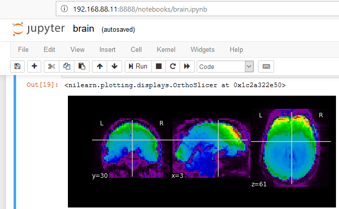

# brain-jupyter

Simple baker environment that supports running jupyter notebooks. Includes example python notebook for analyzing fMRI images.



## Baker environment

``` yaml
name: brain-jupyter
vm:
  ip: 192.168.88.11
lang:
  - python2
tools:
  - jupyter
commands:
  serve: jupyter notebook --no-browser --ip 0.0.0.0 --NotebookApp.token=''
```

## Try it out.

Run `baker bake`. Then start the jupyter server: `baker run serve`.

Visit http://192.168.88.11:8888/notebooks/brain.ipynb

