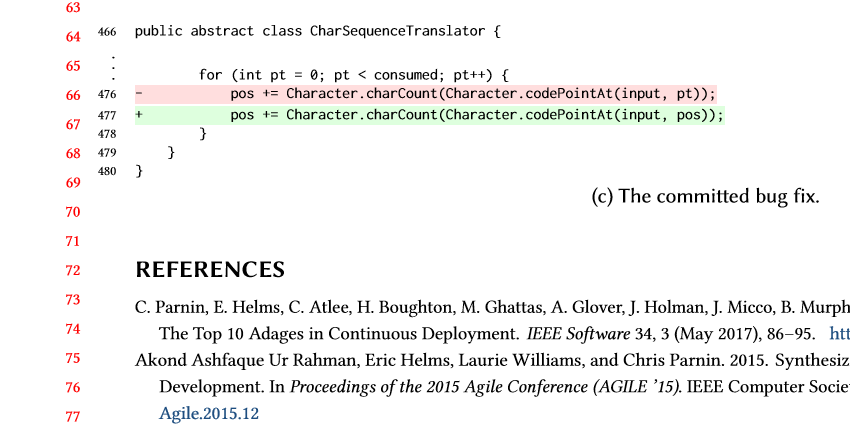

# latex-paper

In this project, we demonstrate creating a [latex](https://www.latex-project.org/get/) that can be used to help build a scientific paper or report.

Latex can be a difficult and unwieldly system to setup. This baker environment provides a simple way to be able to edit, and compile a latex project.

### Baker environment

The [baker environment](baker.yml/) sets up a basic latex environment, which includes dependencies needed to use packages such as [minted](https://www.sharelatex.com/learn/Code_Highlighting_with_minted).

``` yaml
name: latex-paper
persistent: {}
tools:
  - latex: 
commands:
  make: pdflatex main && bibtex main && pdflatex main && pdflatex main && pdflatex main
```

### Try it out

Run `baker bake`. It may take a couple of minutes to download packages (nearly 3GB)!

Run `baker run make`.

Check out the generated main.pdf!




